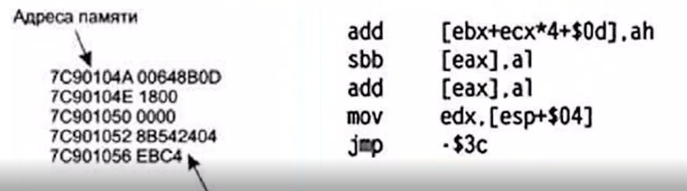
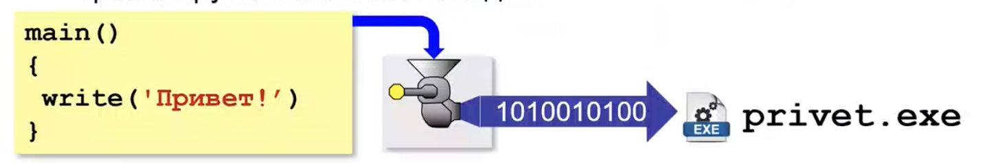
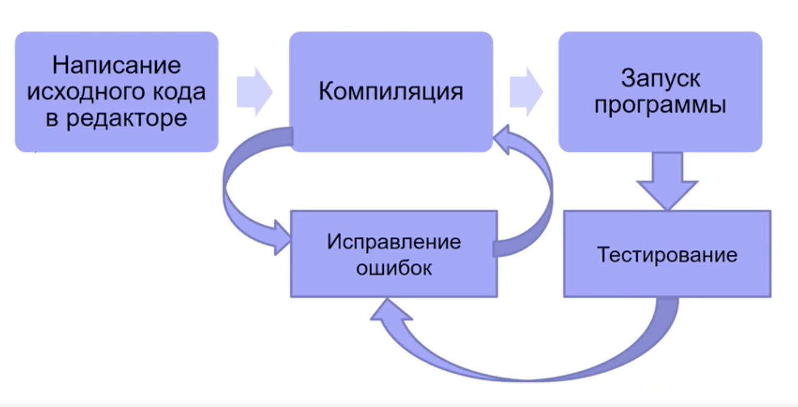

# Урок №1

## Вступление:

1)  Установка python

    <https://www.python.org/downloads/>

2)  Установка сред разработки

    <https://www.spyder-ide.org/download/>

    <https://code.visualstudio.com>

    <https://www.jetbrains.com/pycharm/>

3)  Работа со стандартом PEP8

    <https://peps.python.org/pep-0008/>

## Работа с git:

``` bash
# узнать статус изменений актуальный
git status
# добавить статус в видимую зону
git add FILENAME (or -A)
# зафиксировать изменений с описанием
git commit -m "TYPE DESCRIPTION"
# получить журнал записи
git log
# отправить на удаленный репозиторий
git push
# получить актуальную версию из репозитория
git pull
# создать ветку и перейти туда
git checkout -b test_branch
# удалить ветку 
git branch -d test_branch
```

pythonTutor

<https://pythontutor.com>

## Программирование и языки программирования

-   Программирование - набор общих, универсальных, абстрактных понятий, представляющих некий **процесс**

-   [Языки программирования]{.underline} описывают эти понятия для реализации процесса

    -   У каждого языка свои особенности, достоинства и недостатки

## **Как программировать?**

**Машинный код**

-   Команды, поступающие в процессор по шинам, представляют собой последовательности нулей и единиц, то есть числа.

-   Поэтому программа, с которой работает процессор, представляет собой последовательность чисел, называемую машинным кодом

-   Программа «Hello, world!» для процессора архитектуры х86 выглядит следующим образом (в шестнадцатеричном представлении ):

BB 11 01 B 90 D 00 B 4 0 E 8 A 07 43 CD 10 E 2 F 9 CD

20 48 65 6 C 6 C 6 F 2 C 20 57 6 F 72 6 C 64 21 3

**Язык программирования** - формализованный ЯЗЫК

-   [Язык программирования]{.underline} определяет «слова», понятные транслятору, и правила записи команд (операторов)

    

    Языки программирования высокого уровня не учитывают конкретных компьютерных архитектур

    • Создаваемые программы легко переносятся на другие платформы, для которых создан транслятор этого языка

    ## **Трансляция программы**

    Транслятор - это программа, на вход которой подается текст алгоритма на языке программирования - исходный модуль, а на выходе (после трансляции) получается программа на машинном языке - объектный модуль.

    
    Транслятор действует по строго формальным правилам: если транслируемая программа содержит хотя бы одну формальную (синтаксическую) ошибку, то трансляция не может завершиться!

    ## **Компилятор**

    -   Компилятор автоматически переводит текст программы в машинный код, который затем можно использовать отдельно от текста исходной программы.

    -   Компиляторы полностью обрабатывают весь текст программы.

Они просматривают его в поисках ошибок, а затем транслируют в машинный код.



В результате законченна программа получается компактной и эффективной и может быть преенесена на другие компьютеры с процесором, поддерживающим этот код.

## **Интерпретатор**

-   Интерпретатор сразу выполняет команды языка, указанные в тексте программы.

-   Интерпретатор берет очередной оператор, анализирует его структуру и исполняет, затем происходит переход к следующему оператору и т. д.

-   Программы с большим объемом повторяющихся вычислений могут работать медленно

-   Для работы на другом компьютере требуется наличие интерпертатора.

## Для создания программы нужны:

-   Текстовый редактор

-   Транслятор

-   Библиотеки функций

-   Отладчик

## 

## Синтаксис языка

Синтаксис языка программирования:

-   Система обозначений правильных последовательностей синтаксических элементов программы

-   Формальные правила, которым должна соответствовать программа на некотором языке программирования

-   Определяет «слова», понятные транслятору. и правила записи команд (операторов).

## Синтаксические элементы языка программирования

-   Выражения - конструкции языка для вычисления и изменения значений (включают символы операций и операнды)

    -   Окончание выражения

-   Операторы - конструкции языка, необходимые для управления порядком действий по обработке информации

-   Комментарии - пояснения, включаемые в текст программы, но не обрабатываемые компилятором
    — 02.07.36
