[Задание 0](https://github.com/AndreyPovaliy/ITMO_DS/tree/main/04_basic_statistic/task_0.txt)

Модуль 1. Базовые понятия статистики.

[Задание 1.1](https://github.com/AndreyPovaliy/ITMO_DS/tree/main/04_basic_statistic/task_1_1.txt)

[Задание 1.2](https://github.com/AndreyPovaliy/ITMO_DS/tree/main/04_basic_statistic/task_1_2.txt)

[Задание 1.3](https://github.com/AndreyPovaliy/ITMO_DS/tree/main/04_basic_statistic/task_1_3.txt)

[Задание 1.4](https://github.com/AndreyPovaliy/ITMO_DS/tree/main/04_basic_statistic/task_1_4.py)

[Задание 1.5](https://github.com/AndreyPovaliy/ITMO_DS/tree/main/04_basic_statistic/task_1_5.py)

Модуль 2. Законы распределения случайных величин.

[Задание 2.1](https://github.com/AndreyPovaliy/ITMO_DS/tree/main/04_basic_statistic/task_2_1.py)

[Задание 2.2](https://github.com/AndreyPovaliy/ITMO_DS/tree/main/04_basic_statistic/task_2_2.txt)

[Задание 2.3](https://github.com/AndreyPovaliy/ITMO_DS/tree/main/04_basic_statistic/task_2_3.py)

Модуль 3. Основы математической статистики.

[Задание 3.1 (на Python без библиотек)](https://github.com/AndreyPovaliy/ITMO_DS/tree/main/04_basic_statistic/task_3_1.py)

[Задание 3.1 (на R стандартная библиотека)](https://github.com/AndreyPovaliy/ITMO_DS/tree/main/04_basic_statistic/task_3_1.R)

[Задание 3.2 (на R)](https://github.com/AndreyPovaliy/ITMO_DS/tree/main/04_basic_statistic/task_3_2.R)

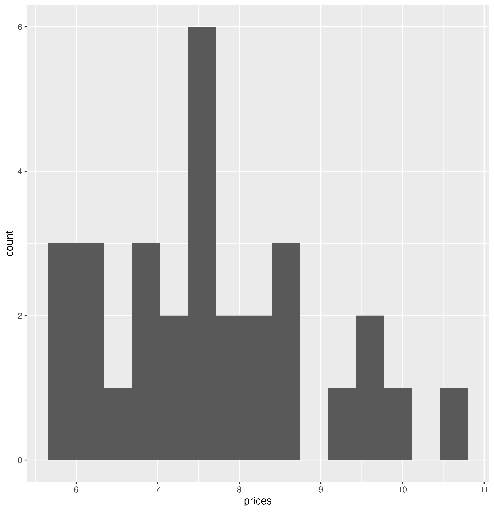

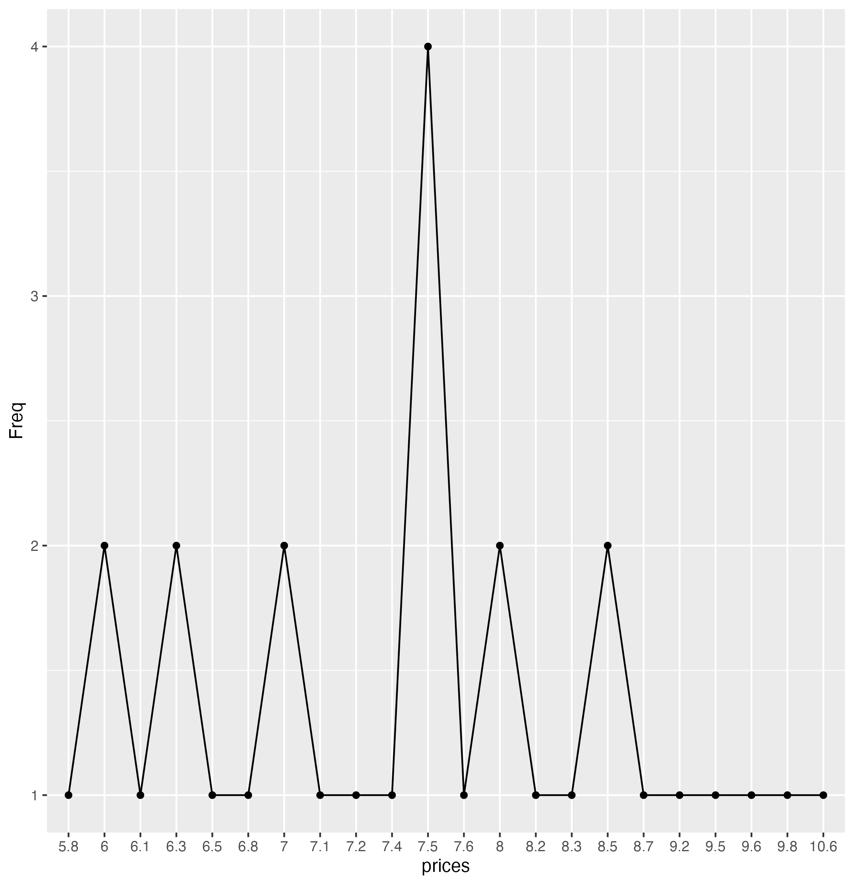

[Задание 3.2 (на Python)](https://github.com/AndreyPovaliy/ITMO_DS/tree/main/04_basic_statistic/task_3_2.py)

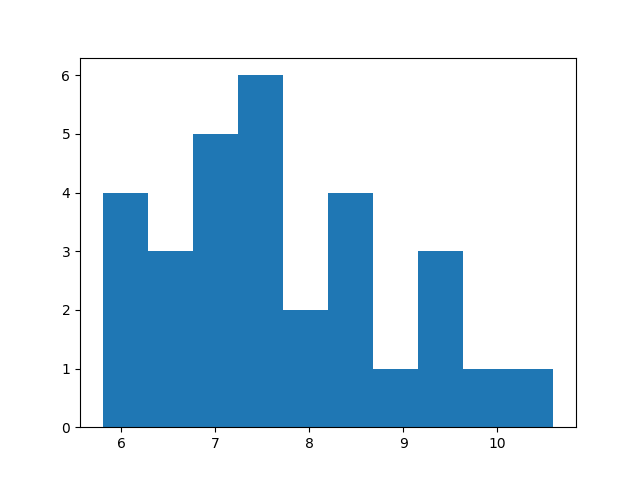

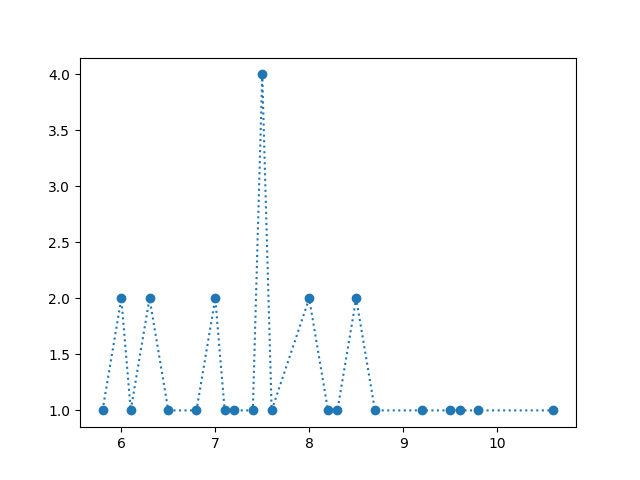

[Задание 3.3 (на R)](https://github.com/AndreyPovaliy/ITMO_DS/tree/main/04_basic_statistic/task_3_3.R)

[Задание 3.3 (на Python)](https://github.com/AndreyPovaliy/ITMO_DS/tree/main/04_basic_statistic/task_3_3.py)

[Задание D](https://github.com/AndreyPovaliy/ITMO_DS/tree/main/04_basic_statistic/task_D.py)

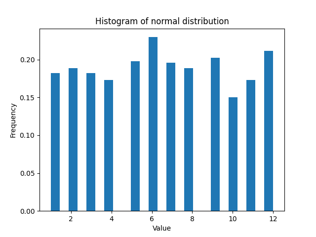

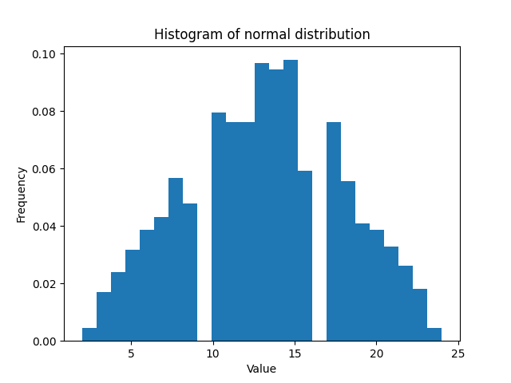

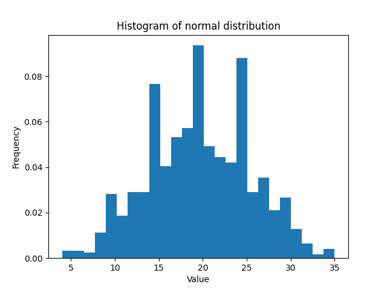

Модуль 4. Основы исследовательского анализа.

[Задание 4.2 (на R)](https://github.com/AndreyPovaliy/ITMO_DS/tree/main/04_basic_statistic/task_4_2.R)

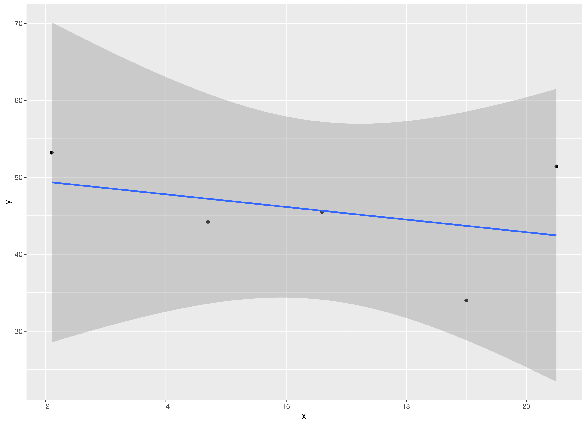

[Задание 4.3 (на R)](https://github.com/AndreyPovaliy/ITMO_DS/tree/main/04_basic_statistic/task_4_3.R)

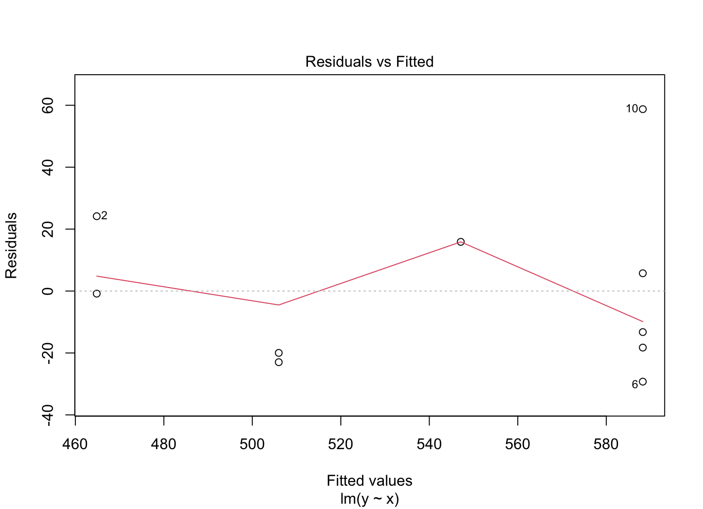

[Задание 4.4 (на R)](https://github.com/AndreyPovaliy/ITMO_DS/tree/main/04_basic_statistic/task_0.txt)

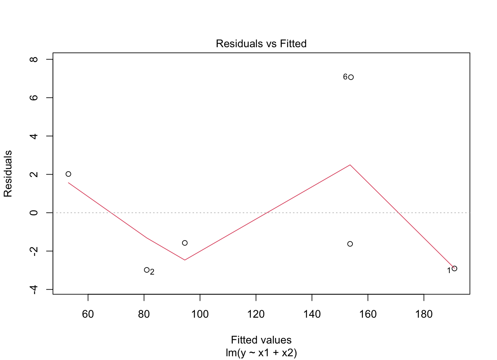

[Задание 4.1 (на R)](https://github.com/AndreyPovaliy/ITMO_DS/tree/main/04_basic_statistic/task_4_1.R)

[Задание 4.5 (на R)](https://github.com/AndreyPovaliy/ITMO_DS/tree/main/04_basic_statistic/task_4_5.R)

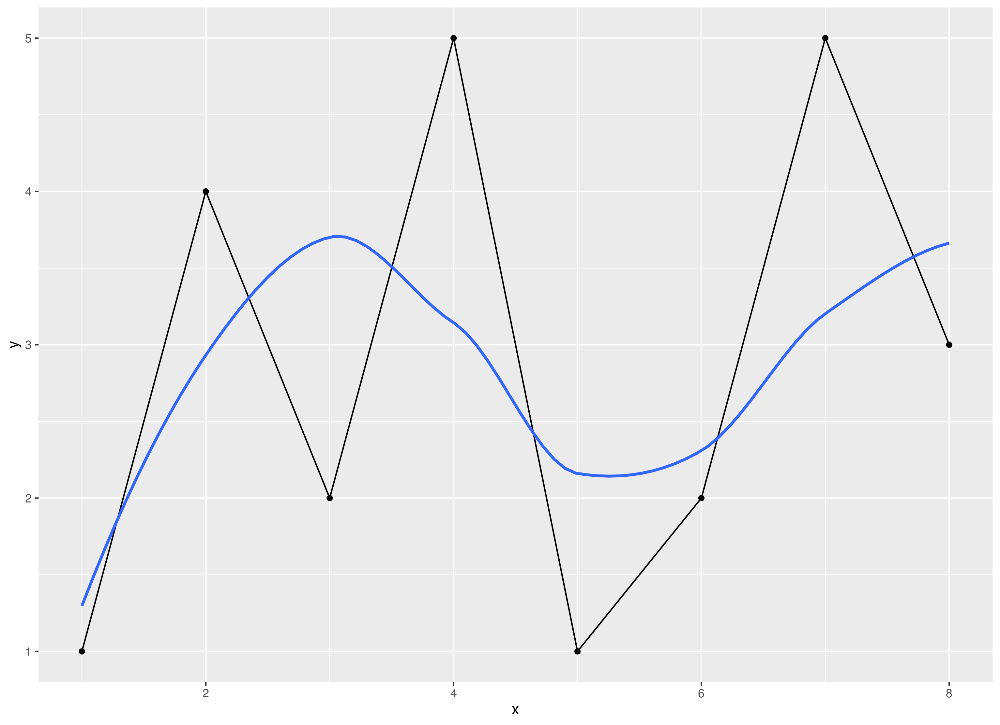

[Задание П (на R)](https://github.com/AndreyPovaliy/ITMO_DS/tree/main/04_basic_statistic/task_P.R)

[Задание Z (на R)](https://github.com/AndreyPovaliy/ITMO_DS/tree/main/04_basic_statistic/task_Z.R)
