```{r setup, include=FALSE}
knitr::opts_chunk$set(echo = F)
```

## 1. Введение

Рак молочной железы является глобальной проблемой, и ежегодно диагностируется 1,7 миллиона новых случаев. Примерно 60% смертей от рака молочной железы приходится на развивающиеся страны [@torre2015; @lee2016], в то время как в Соединенных Штатах (США) ежегодно диагностируется около 249 260 новых случаев рака молочной железы, и смертность от этого заболевания снижается [@siegel2016a]. Напротив, рак молочной железы в ДК составляет половину всех случаев рака молочной железы и 62% смертей [@torre2015]. Ожидается, что в Бразилии заболеваемость раком молочной железы будет примерно в четыре раза ниже, чем в США, но это увеличение заболеваемости связано с увеличением смертности, связанной с раком молочной железы [@chatenoud2010a]. Несмотря на достижения в области медицины, рак молочной железы диагностируется на поздних стадиях в странах с ограниченными ресурсами, поскольку раннее выявление, диагностика и лечение не могут быть эффективно пропагандированы. Чтобы оценить сложность системы здравоохранения [@anderson2006] в отношении рака молочной железы, «Глобальная инициатива по здоровью молочной железы» [@anderson2006] попыталась классифицировать организационные уровни стран в отношении рака молочной железы. В частности, на базовом уровне поощряется самообследование молочных желез, в то время как диагностическое ультразвуковое исследование и маммография доступны на ограниченном уровне. На повышенном уровне пациентки имеют доступ к диагностической маммографии с оппортунистическим скринингом молочной железы, а на максимальном уровне популяция проходит организованный скрининг на рак молочной железы [@anderson2006].

Однако к вопросам скрининга у МЖ нужно относиться осторожно [@garanina2024; @rozhkova2021]. Маммография выявляет от 2 до 8 случаев рака на 1000 маммографий . Чувствительность маммографии снижается у женщин с плотной молочной железой. Так же стоит сказать о группах пациенток ранней возрастной группы, то есть до 40 лет, где использование маммографии малоэффективно [@kempjacobsen2015; @sickles2005].

Согласно исследованиям, скрининг с помощью 2D ультразвукового исследования (2D УЗИ) в дополнение к маммографии у женщин с плотной грудью продемонстрировал увеличение показателей выявления рака молочной железы, которые варьировались от 1,8 до 4,6 случаев рака на 1000 обследованных женщин, в зависимости от стратификации населения по риску [@garanina2024; @гажонова2015возможности]. Однако исследования программ скрининга в Дании у МЖ [@garanina2024] с включением маммографии (ММГ) показали снижение смертности, объясняется это изменениями факторов риска и улучшением лечения, а не скрининговой ММГ. Однако УЗИ имеет ограничения, а именно отсутствие стандартизации метода, требуемый высокий уровень навыков и опыта, затраты времени [@garanina2024; @garanina2024a]. Поэтому для скрининга рака молочной железы было разработана новая методика - объемного автоматизированного объемного сканирования молочных желез (3D УЗИ). Новое поколение 3D УЗИ предлагает автоматическое сканирование молочной железы с помощью датчика с большим полем обзора, позволяющего получать изображения с высоким разрешением. Форма датчика специально разработана с учетом нормальной кривизны молочной железы, сводя к минимуму индуцированные артефакты на периферии [@vourtsis2017]. На сегодняшний день 3D УЗИ является потенциалом развития в направлении развития скрининга рака молочной железы, в частности у МЖ [@garanina2024].

Существуют исследования по панелям мониторинга на основе регулярно собираемых данных клинических показателей. Тое сть создания информативных дашбордов. Bernard Bucalon и коллеги сообщили в 2022 году [@bucalon2022], что в исследованиях использовались общие методы визуализации данных и клинические показатели, наблюдалось разнообразие в дизайне панелей мониторинга и их оценке. Отсутствовали подробности относительно процессов проектирования, задокументированных для воспроизводимости. Мы выявили отсутствие функций интерфейса, которые помогали бы врачам осмысливать и размышлять над своими данными об эффективности. Из этого следует, что область визуальных аналитических систем в медцине явлеется новой и нестандартизированной.

Машинное обучение также является важно точко развития в заявленной области. Алгоритмы машинного обучения (ML) применяются в медицине для прогнозирования исходов, диагностики и лечения [@rajkomar2019]. Например, ML-модель используется для дифференциации доброкачественных образований молочной железы и рака молочной железы на основе ультразвуковых изображений [@liu2022]. Но логика и сложность различных алгоритмов ML различны [@bian2019], а также могут быть различия в клиническом применении. В исследовании [@zhang2019] сравнивались диагностические характеристики различных алгоритмов ML при диагностике доброкачественных и злокачественных узлов щитовидной железы и было обнаружено, что модель случайного леса обеспечивает наилучшую площадь под кривой рабочих характеристик (ROC AUC = 0,924). Из-за сложной нелинейной взаимосвязи некоторых алгоритмов ML результаты моделирования трудно интерпретировать, что приводит к проблеме “черного ящика” [@castelvecchi2016], которая ограничивает клиническое применение прогностических моделей. Однако это отдельная область изучения, которая не рассматривается в настоящей дипломной работе, но непосредственно может повлиять на результаты настоящего исследования.

Изучение выше описанной области требует применение техник работы с большими данными данными, применение современных библиотек языков программирования, в частности Python и другие. Так же необходимо создание информационно-аналитической системы, а именно интерактивного дашборда. Это позволит в реальном времени понимать состояние исследуемуе кагорты пациенток. Это необходимо для уточнения и формулирования научных гипотез в рамках исследования проблемы скрининга рака молочной железы.

## 2. Цель

Необходимо разработать информационно-аналитическую систему (интерактивный дашборд), позволяющий пользователям получать доступ к результатам исследований рака молочной железы.

## 3. Задачи

1.  Провести сбор и обработку данных.
2.  Провести исследовательский анализ данных для выявления тенденций, распределений и аномалий.
3.  Использовать методы статистического анализа и машинного обучения для определения взаимосвязей между потенциальными факторами маршрутизации пациента.
4.  Подготовить результаты анализа в виде блокнота Jupyter Notebook.
5.  Разработать интерактивный дашборд для представления результатов исследования средствами Python библиотек (Pandas, Numpy, Matplotlib, Seaborn, Skikit-Learn, Statsmodels, Plotly, Dash и другими).
6.  Разработать модель машинного обучения, способную определять с минимальной погрешностью маршрутизацию пациента.
7.  Интегрировать модель машинного обучения в приложение.
8.  Разработать интерактивную форму (как часть информационно-аналитической системы), для использования предсказательной модели машинного обучения.
9.  Развернуть приложение в облачном сервисе.

## 4. Материалы и методы

Всего в исследование вошло 2794 пациенток. Критерии включения были пациенты женского пола в возрасте от 18 до 80 лет; женщина, посетившая врача для обследования рака молочной железы, с отсутствием видимых признаков рака молочной железы. Критериями исключения были: женщины, которые были беременны, кормили грудью или планировали забеременеть; оперативное лечение в анамнезе (лампэктомия, мастэктомия, увеличение груди), Эксцизионная или чрескожная биопсия за последние 12 месяцев, пациентки, получавшие лечение по поводу рака молочных желез за последние 12 месяцев. В это исследование была включена одна медицинская клиника- «СМТ», состоящая из двух зданий -амбулаторно-поликлического комплекса и хирургического корпуса со стационаром. Все женщины из амбулаторного отделения были приглашены для участия в нашем исследовании, участники подписали форму информированного согласия. Все обследования были проведены медицинским персоналом с соответствующей квалификацией. Всем провели клинический осмотр, пальпацию, собрали информацию о социально-демографических данных и потенциальных факторах риска РМЖ.

Для подготовки .csv файла для проекат был выполнен парсинг текстовых файлов с использованием tidytext, tidyverse языка R. Этот этап был выполнен до настоящего проекта в рамках нучных исследовний клиники.

Для выполнения очистки данных были использованы средства Pandas, Numpy, Matplotlib, Seaborn, языка програмирования Python.

Pandas был разработан Уэсом МакКинни в 2008 году для поддержки операций анализа данных. Анализ данных влечет за собой огромный объем обработки для реструктуризации, очистки или слияния больших объемов данных. Существуют различные инструменты, доступные для быстрой обработки данных, такие как NumPy, SciPy, Но Pandas предпочтительнее, поскольку он быстрый, простой и более выразительный, чем другие инструменты. Часто возникает некоторая путаница относительно того, является ли Pandas альтернативой NumPy, SciPy и Matplotlib. Правда в том, что он построен поверх NumPy, что означает, что NumPy требуется для работы Pandas, SciPy и Matplotlib, До появления Pandas Python был способен подготавливать данные, но он обеспечивал лишь ограниченную поддержку анализа данных. Pandas расширил возможности анализа данных Python. Он может выполнять следующие пять важных шагов, необходимых для обработки и анализа данных независимо от происхождения данных, т. е. загружать, манипулировать, подготавливать, моделировать и анализировать. Он также предоставляет эффективные структуры данных и операции для обработки числовых таблиц и временных рядов. В этой главе мы сосредоточимся на механике эффективного использования Series, DataFrame и связанных структур[@gupta2024; @teoh2022].

Для проектировки визуализации и проекта дашборда использовались Plotly, Dash.

Для создании модели машинного обучения в рамках решения задачи маршуртизации использовались Skikit-Learn, Statsmodels.

Immaculate Joy S и коллеги в 2023 [@s2023] году сообщили что машинное обучение стало предметом исследований и было признано эффективным методом имеено в обрасти исследования рака молочной железы. В последнее время многие ученые заинтересовались развивающейся техникой машинного обучения. Scikit-learn используется для создания модели, которая классифицирует рак молочной железы как злокачественный или доброкачественный. Благодаря раннему выявлению, 5-летняя выживаемость пациенток с раком молочной железы превышает 82%. Конечная цель этого проекта - помочь клиницистам в анализе огромных баз данных, содержащих данные о раке, и выявлении закономерностей, используя данные о пациентах и сами данные о раке.

## 5. Выполнение работы

### 5.1 Провести сбор и обработку данных.

Исходные данные получены при текстовом анализе медицинских карт, заключений УЗИ, ММГ и 3D УЗИ. Текстовые данные были оформлены в dataframe, который был записан в файл .csv.

### 5.2 Провести исследовательский анализ данных для выявления тенденций, распределений и аномалий.

В расмках этой задачи был выполнен анализ категориальных данных, которые преимущественно были представлены, с целью соответсвия классифкаторам и используемым словам в заключениях и прочей первичной медицинской документации.

### 5.3 Использовать методы статистического анализа и машинного обучения для определения взаимосвязей между потенциальными факторами маршрутизации пациента.

Был проведен статистического анализа и машинного обучения для определения взаимосвязей между потенциальными факторами маршрутизации пациента с ипользованием pandas matplotlib seaborn sklearn, а именно RandomForestClassifier, train_test_split, GridSearchCV, cross_val_score, accuracy_score. Была подобрана наиолее эффективная ансамблевая модель (Рисунок 1а, Рисунок 1б), которая в дальнейшем была применена для поных данных, вводимиых пользователем на дашборде.

Во многих научных областях, включая медицину, науки о жизни и экономику, анализ продольных данных играет жизненно важную роль. Возьмем в качестве примера точную медицину. Целью точной медицины является предоставление пациентам индивидуального лечения на основе их характеристик и, таким образом, повышение эффективности лечения при избежании серьезных побочных эффектов [@ashley2016; @jameson2015].

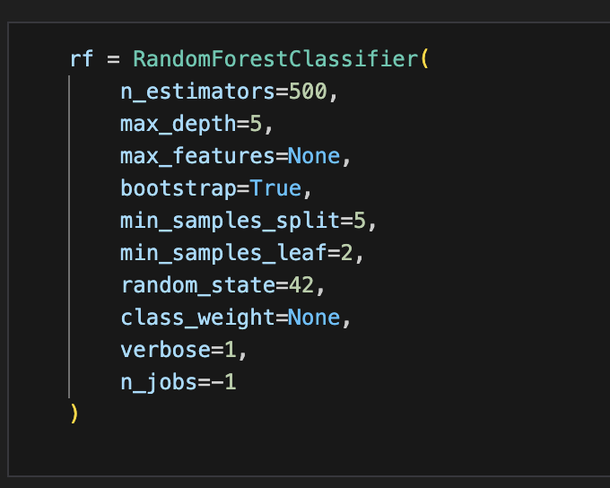

Рисунок 1а - Модель машинного обучения Random Forest с определнным параметрами.

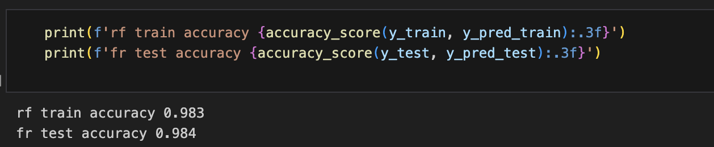

Рисунок 1б - Оценка качества модели.

Таким образом решены также задачи "Разработать модель машинного обучения, способную определять с минимальной погрешностью маршрутизацию пациента" и "Подготовить результаты анализа в виде блокнота Jupyter Notebook"

### 5.4 Разработать интерактивный дашборд для представления результатов исследования средствами Python библиотек

Разработан интерактивный дашборд для представления результатов исследования средствами Python библиотек, а именно Pandas, Numpy, Matplotlib, Seaborn, Skikit-Learn, Statsmodels, Plotly, Dash (Рисунок 2).

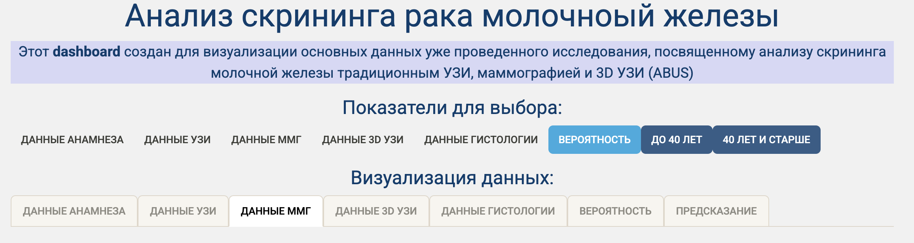

Рисунок 2 - Интерактивный дашборд для представления результатов исследования

С токи зрения функчиональных возможности реализована панель для выбора показателй по данным анамнеза, УЗИ исследования, исследования ММГ. 3d УЗИ, данных гистологии (Рисунок 3), где иеется возможность выбирать выборку из общей кагорты пациентов.

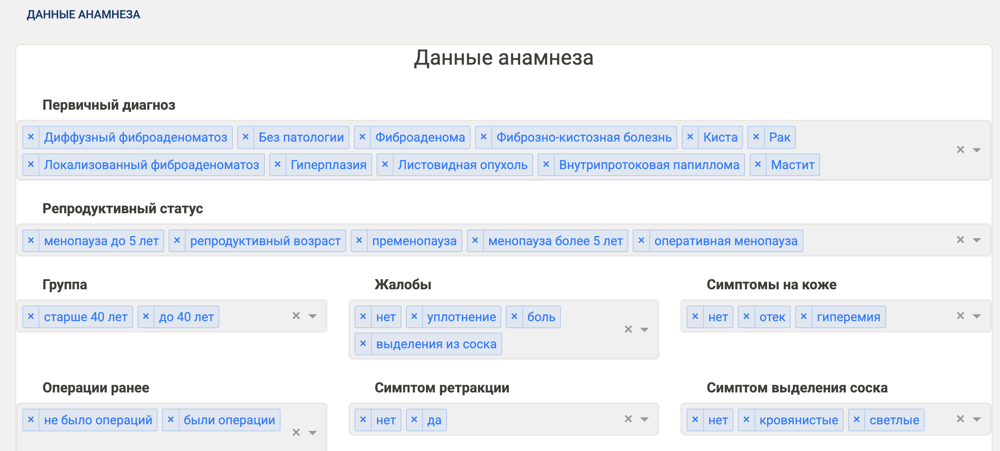 Рисунок 3 - Панель для выбора показателй по данным анамнеза, УЗИ исследования, исследования ММГ. 3d УЗИ, данных гистологии.

Также реализована панель для визуализации основных показателй по данным анамнеза, УЗИ исследования, исследования ММГ. 3d УЗИ, данных гистологии (Рисунок 4).

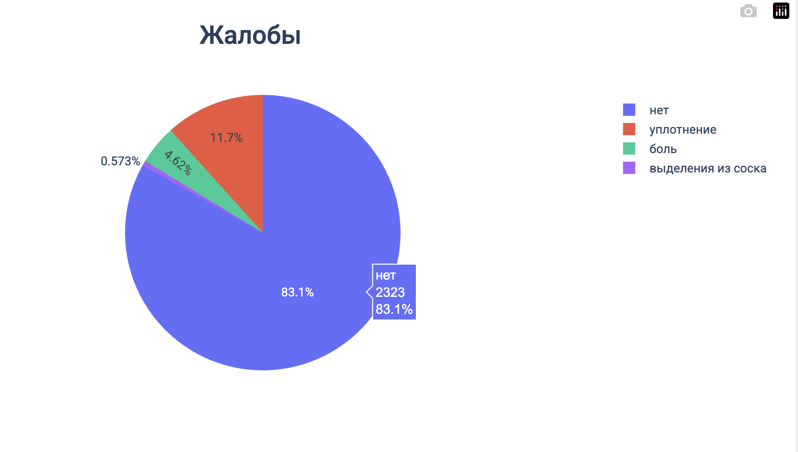 Рисунок 4 - Пример графика по отдельному показателю жалобы из данных анамнеза.

Отдельно реализованы селеторы (Рисунок 5а) и визуализация (Рисунок 5б), предварительно расчитанных методом логит регресии, для определения веротяность обнаружения кальцинатов, как важных предикторов рака МЖ и непосредственно злокачественного новообразования.

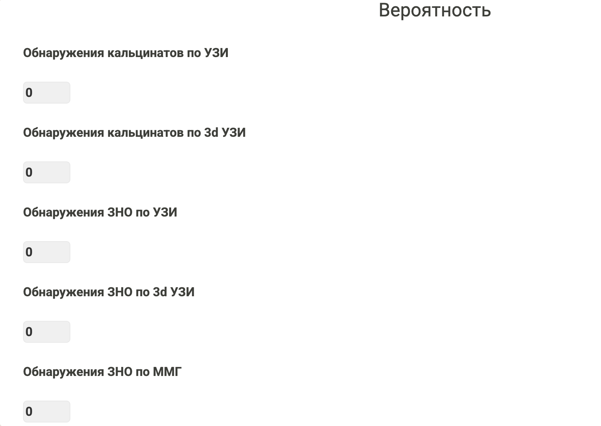 Рисунок 5а - Селекторы для определения выборки по веротности обнаружения кальцинатов и ЗНО.

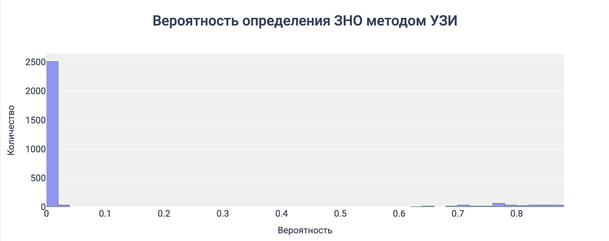 Рисунок 5б - Изуализация опредления ЗНО методом УЗИ

Чтобы сопоставить визуализацию и веротяность определения ЗНО и кальцинатов реализовано информационное табло, где можно наглядно видеть не только грфики, но и существующую конфигурацию веротности обнаружения ЗНО и кальцинатов (Рисунок 6). 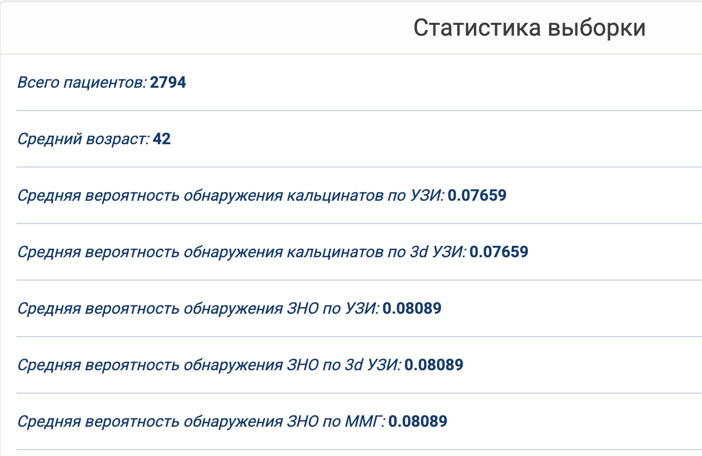 Рисунок 6 - Информационное табло с конфигурацией веротности обнаружения ЗНО и кальцинатов.

### 5.5 Интегрировать модель машинного обучения в приложение

Разработанная ранее модель машинного обучения внедрена в интерактивный дашборд с по помощью отдельных вкладок "до 40 лет" и "после 40 лет". Главной идеей послужило то, что это разделения принципиально с клинической точки зрения. Из этого следует, что использовать для предсказания не соответсвущую возрастную группу не имеет смысла. Также тоит сказать, что данные ММГ есть только в возрастно группе "после 40 лет". Основной задачей предсказательной системы являлась определение маршуртизации пациентки. Варианта выбота представлено 2: 1) традиционный метод УЗИ (Рисунок 7а) и 2) автоматизированная трехмерная УЗИ (Рисунок 7б).

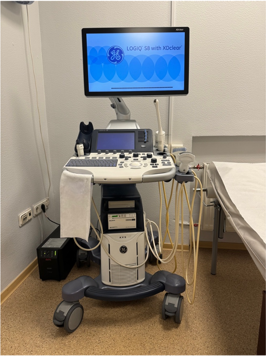 Рисунок 7а - Toshiba Aplio 300 (Canon Япония), ультразвуковая система экспертного класса.

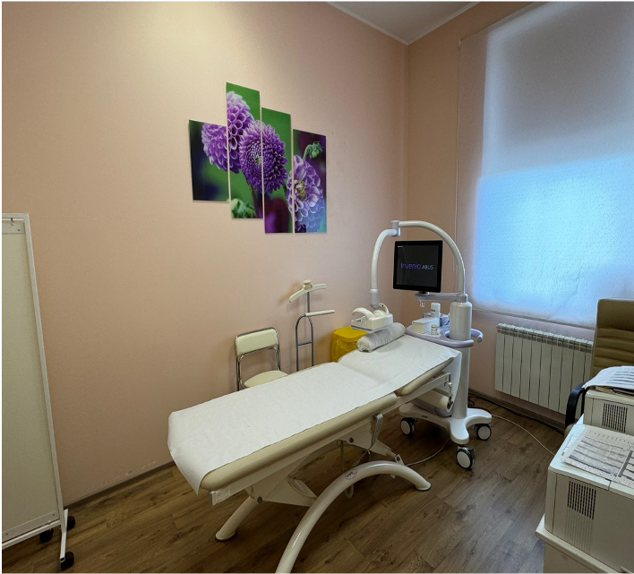

Рисунок 7б - Система Invenia (ABUS) оцениваемая в данном исследовании, производства GE Healthcare (Саннивейл, Калифорния, США)

Решение данной задачи преследует цель опртичмизации потоков. Автоматизированная трехмерная УЗИ система позволяет сократить нагрузка на лечебное учереждение без потери качества скрининга. Если обратить нимание на распределние веростностей обнаружения ЗНО, то мжно обратить внимние, что пациенток, у которых эта вероность высокая меньшинство. Из все выборки 256 пациенток имеют вероятность обнаружения более 0.5, что составляет 9.16% от общего числа пациентов. Или если посмтореть на количество верифицированных диагнозов, а именно 226 пацеинтов, что составлояет 8.08%. То есть всего 8.08% - 9.16% пациентов нуждаются в осмторе врачом традиционным методом УЗИ, осатльные могут проходить скрининг рака МЖ автоматизированной трехмерной УЗИ системой.

В настоящем дашборде раилизована вкладка для введения данных согласно используемым классификаторам (Рисунок 8).

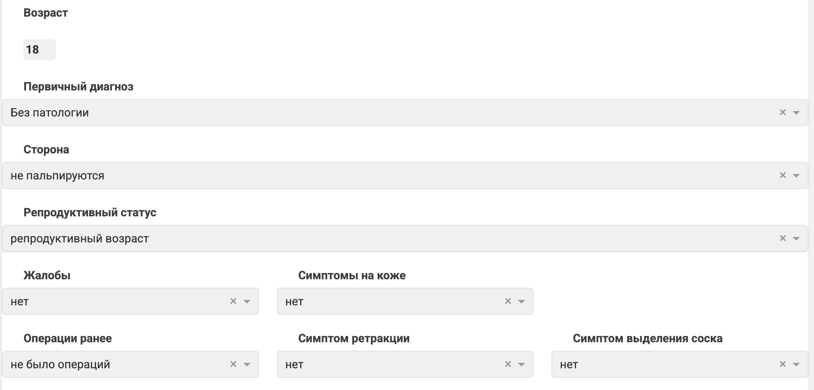

Рисунок 8. Поля вводы данных нового пацинта, для осуществления предсказания маршрутизации пациета.

Результат предсказания можно увидеть в соотвествующей вкладке "предсказание" (Рисунок 9).

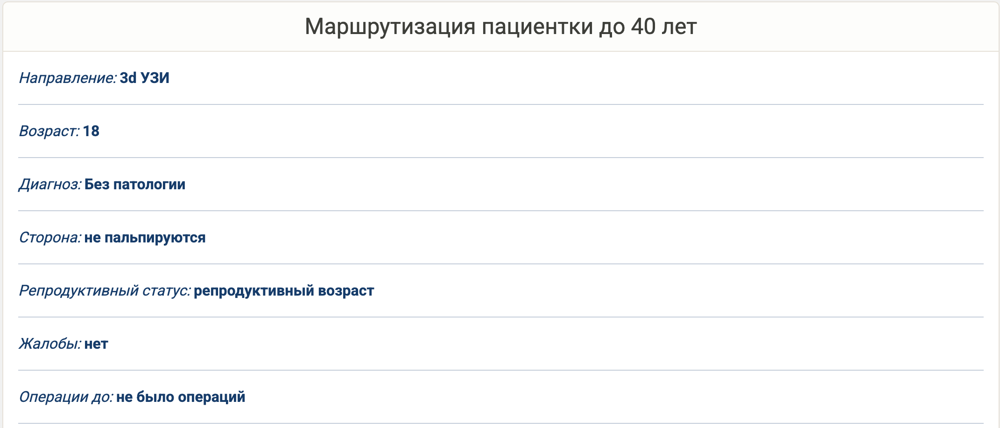 \### 5.6 Развернуть приложение в облачном сервисе

Настояще приложение развернутоа в облачном сервисе и функционирует по адресу <http://217.18.63.8/>. Таким образом выполенени=ы все задачи и достигнута цель настоящей дипломной работы.

## 6. Заключение

Целью настоящей дипломной работы было разработать информационно-аналитическую систему (интерактивный дашборд), позволяющий пользователям получать доступ к результатам исследований рака молочной железы. Были поставлены задачи для последовательного выполнения, которые были выполнены.

Выполненное приложение можно охарактеризовать как продукт, обладающий минимальными, но достаточными для удовлетворения первых потребителей функциями.

Для дальнейшего развития проекта требуется замена исходно таблицы .csv на реляционную базу данных. Это позволит создать отдельны функционал, которй позволит пооплнять базу данны новыми заключениями. Этот функционал можно реализовать по тому же принципу как и была создана таблица в настоящей дипломной работе, а именно персер текста с заранее заданами класификаторами слов. Так же перспективным. направлением является разаботака систем глубокого обучения изображений, где можно сопоставлять текстово-аналитическую информацию от врача и непосредстванно изображения.

Настоящий проект имеет несколько точек развиятия с точки зрения предметно области. Например, равитие автоматизированых систем подсказчиков неповредсвенного обнаружения интересующего образоания и это зависит от цели, которую ставит врач исследователь. Также преспективным является создание организационных механизмов, например как маршуртизация пациента, рекомендация схемы обследования пациетна и тд. Немаловажным является оценка оказания медицинской помощи. Реализация дашборда позволяет визуализировать данные и заподозрить ошибки: такие как неверное заключение, неверные данные. И менно дашбор в руках опытного специалиста становится инфтрументом для анализа текущей ситуации. Также стоит сказать, что сбор медицинских данных - это сложна задача, требующая не только научной и врачебной квалификации специалиста, но и умение работать с данными. Такое условние необходимо для наувчной работы, где качество исследуемых данных явлется определяющим условем научного обоснования гипотезы.

Приложение выполененное в настоящей дипломной работе показывает минимальные возможности, необходимые для врача клинициста, управленица и исследователя.

## Список сокращений

2D УЗИ – двумерное ультразвуковое исследование 3D УЗИ – трехмерное ультразвуковое исследование ВОЗ – Всемирная организация здравоохранения ЗНО - злокачественных новообразований МЖ - молочная железа МРТ – магнитно-резонансная томография РМЖ - Рак молочной железы РФ - Российской Федерации США - Соединенные Штаты Америки ЦММГ - цифровой маммографии

## Приложения

Листинг №1. Пример кода точки входа приложения, язык программирования Python.

``` python
from dash import Dash
from layouts import create_layout
from callbacks import register_callbacks
import dash_bootstrap_components as dbc

app = Dash(external_stylesheets=[dbc.themes.SANDSTONE])
app.title = "Скрининг рака молочноый железы"
server = app.server

app.layout = create_layout()

register_callbacks(app)

if __name__ == "__main__":
    app.run(debug=True)
```

Листинг №2. Пример расчета вероятности, язык программирования R.

``` r
library(openxlsx)
library(psych)
library(ggplot2)
library(caret)

fit_preDiagJun<- glm (dfXlsxJun$hist_is_tumor  ~
                         age_patient +
                         diagnosis_primary +
                         side   + 
                         satus_reproductive +
                         complaints +
                         breast_surgery_before +
                         nipple_retraction +
                         nipple_release +
                         quadrant +
                         genetics +
                         hormonal_medications 
                      , dfXlsxJun, family = "binomial")


summary(fit_preDiagJun)
exp(coef(fit_preDiagJun))


dfXlsxJun$preDiagJun <- predict(object = fit_preDiagJun, type = "response")
```

Листинг №3. Пример создания модели машинного обучения Python.

``` python
import pandas as pd
import numpy as np
import matplotlib.pyplot as plt
import seaborn as sns
from sklearn.ensemble import RandomForestClassifier
from sklearn.model_selection import train_test_split, GridSearchCV, cross_val_score
from sklearn.metrics import accuracy_score, classification_report
from sklearn.ensemble import GradientBoostingClassifier

df = pd.read_csv('data/us_data.csv')

X = df_us_jn.drop('hist_is_tumor', axis=1)
y = df_us_jn['hist_is_tumor']

X_train, X_test, y_train, y_test = train_test_split(X, y, test_size=0.20, random_state=42, stratify=y)

rf = RandomForestClassifier(
    n_estimators=500, 
    max_depth=5, 
    max_features=None, 
    bootstrap=True, 
    min_samples_split=5,
    min_samples_leaf=2, 
    random_state=42,
    class_weight=None,
    verbose=1,
    n_jobs=-1
)

rf.fit(X_train, y_train)
y_pred_train = rf.predict(X_train)
y_pred_test = rf.predict(X_test)

rf.predict(X_test)

print(f'rf train accuracy {accuracy_score(y_train, y_pred_train):.3f}')
print(f'fr test accuracy {accuracy_score(y_test, y_pred_test):.3f}')

rf.feature_importances_
```

## Список литертуры
